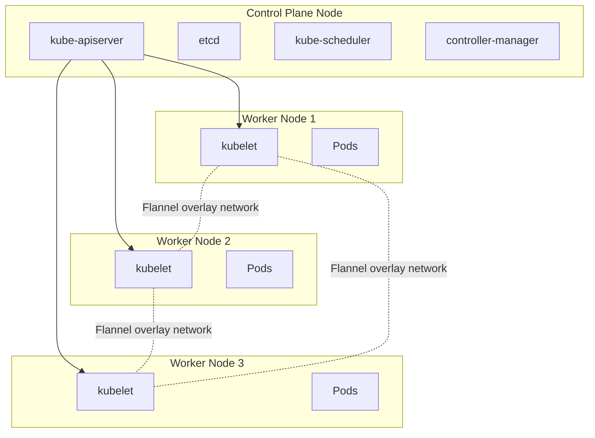

# Homelab Kubernetes Cluster

A self-managed Kubernetes cluster built from repurposed PCs/laptops, set up with `kubeadm` and Flannel — a hands-on project to learn cluster administration from the ground up rather than relying on a managed service.

## Overview

| | |
|---|---|
| **Goal** | Learn Kubernetes cluster administration by building one manually on real hardware |
| **Hardware** | 4x repurposed mini PCs |
| **Cluster setup tool** | `kubeadm` |
| **Container runtime** | containerd |
| **CNI (pod networking)** | Flannel |
| **Topology** | 1 control plane node + 3 worker nodes |
| **Status** | Cluster operational, no workloads deployed yet (see [Roadmap](#roadmap--next-steps)) |

## Why I built this

Managed Kubernetes services (EKS, GKE, AKS) hide most of the work that actually teaches you how the system functions — node bootstrapping, the container runtime interface, networking, and certificate management all happen behind the scenes. I wanted to understand what a managed control plane is actually doing, so I built one manually on hardware I already had, using `kubeadm` instead of a lightweight distro like k3s, specifically because `kubeadm` doesn't make any opinionated choices for you — you have to choose and wire up the container runtime and CNI plugin yourself.

## Architecture



**Networking note:** Flannel was chosen over Calico or Cilium for the initial build because it's the simplest CNI to reason about — a straightforward overlay network with minimal configuration — which mattered most while I was still learning how pod networking works at all. Calico's network policy support is on the roadmap once the basics are solid (see below).

## Setup decisions and why

| Decision | Reasoning |
|---|---|
| `kubeadm` over k3s/k0s | Lightweight distros bundle and pre-configure components (often including their own CNI). Using `kubeadm` meant manually choosing and installing the container runtime and CNI separately, which forced me to actually understand how those pieces connect. |
| containerd over Docker | Docker Engine support (dockershim) was removed from Kubernetes; containerd is the standard CRI-compliant runtime now used directly by kubeadm. |
| Flannel over Calico/Cilium | Simpler to set up and debug while learning; revisit once core operations are solid. |
| Bare metal over VMs | Wanted to handle real hardware constraints (mixed specs, physical networking, no hypervisor abstracting NICs away). |
| 1 control plane / 3 workers | Matches available hardware; single control plane is acceptable for a learning cluster (HA control planes are a documented next step). |

## What's running on it

Nothing yet — the cluster itself (control plane, node join, pod networking) is fully operational and verified, but no workloads have been deployed. See [Roadmap](#roadmap--next-steps) for what's planned.

## How it was built (high level)

1. Installed and configured a compatible OS on all nodes; disabled swap (a hard requirement for `kubeadm`).
2. Installed `containerd` as the container runtime on every node, with matching cgroup driver configuration on the kubelet.
3. Installed `kubeadm`, `kubelet`, and `kubectl` on all nodes.
4. Ran `kubeadm init` on the designated control plane node.
5. Installed Flannel as the CNI so pods could get IPs and communicate across nodes.
6. Joined each worker node to the cluster using the `kubeadm join` command/token generated by `kubeadm init`.
7. Verified all nodes reached `Ready` status and core system pods were running cleanly.

## Verifying the cluster

```bash
kubectl get nodes -o wide
kubectl get pods -A
```

All nodes report `Ready`, and all `kube-system` pods (including `kube-flannel`) are `Running`.

## Roadmap / next steps

This cluster is intentionally being built in stages — infrastructure first, workloads next:

- [ ] Deploy first real workload (likely a small self-hosted app to validate networking end-to-end)
- [ ] Add an Ingress controller (NGINX) for external access
- [ ] Add persistent storage (Longhorn or local-path-provisioner)
- [ ] Add monitoring (Prometheus + Grafana)
- [ ] Evaluate moving to HA control plane (multiple control-plane nodes)
- [ ] Evaluate Calico for network policy support

## What I'd do differently

- Document hardware specs and OS versions per node from day one — useful in hindsight for debugging and for showing reproducibility.
- Consider Ansible for node provisioning earlier, rather than configuring each node by hand, to make the setup reproducible from scratch.

## Skills demonstrated

Linux system administration, container runtimes (containerd), Kubernetes cluster bootstrapping (`kubeadm`), pod networking / CNI (Flannel), command-line cluster operations (`kubectl`), infrastructure planning and documentation.
